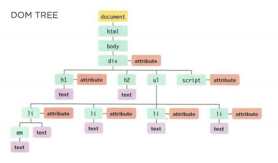

# Read06
### What is an object?
Objects group togather a set of variables and functions to create a modle of something you would recognize from the real worldin an object, variables and function take new names.
Every objects in javascript content a key and value.
Objests content his keys and values betweem two curly braces.
Every key and value between them a : a colon it's split between them.

### Properties & Methods
- Properties : 
  - variable become know as properties in an objects.
  - it's tell us about the objects.

- Methods : 
  - function become know as methods in an objects.
  - represent tasks that are assicated with the objects.

### Accessing an object
You can access the properties and methods of an objects using notation (.), and you can access properties using square brackets but not prefare using it.

### DOM
- The Document Object Model (DOM) specifies how browsers should create a model of an HTML page and how JavaScript can access and update the contents of a web page while it is in the browser window. 
- Each object represents a different part of the page loaded in the browser window. 
- You will hear people call the DOM an Application Programming Interface (API). 
- Relationships between the document and all of the element nodes are described using the same terms as a family tree: parents, children, siblings, ancestors, and descendants. (Every node is a descendant of the document node.) 

- Attribute nodes.
- Text nodes.

### Access the elements.
- select an individual element node.
- select muiltple elements, node list.
- traversing between element nodes.
