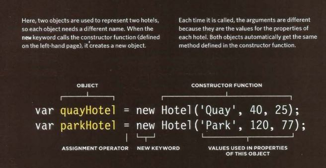

# Read07
### Tables
##### What is a table ??
A table represents information in grid format.
Grids allow us to understand complex data by referencing information on two axes.
##### Basic table structure
- table tag : The <table> element is used to create a table. The contents of the table are written out row by row.
- tr : You indicate the start of each row using the opening <tr> tag, It is followed by one or more <td> elements.
- td : Each cell of a table is represented using a <td> element.
- th : The <th> element is used just like the <td> element but its purpose is to represent the heading for either a column or a row.
##### Long tables.
There are three elements that help distinguish between the main content of the table and the first and last rows.
- <thead> : The headings of the table should sit inside the <thead> element. 
- <tbody> : The body should sit inside the <tbody> element. 
- <tfoot> :  The footer belongs inside the <tfoot> element.

### Constructor 
Sometimes you will want several objects to represent similar things.
Object constructors can use a function as a template for creating objects. First, create the template with the object's properties and methods. 
