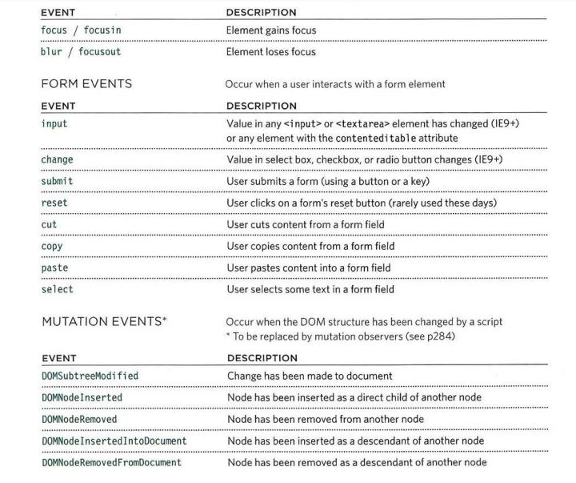

# Read09

### Forms

##### Form elements
Use to collect information from visitors to your site.
- ADDING TEXT: 
  - Text input 
  - Password input
  - Text area 
- Making Choices:
  - Radio buttons
  - Checkboxes
  - Drop-down boxes 
- Submitting Forms
  - Submit buttons
  - Image buttons
  - File upload  

  ##### How Forms Work
1. The name of each form control is sent to the server along with the value the user enters or selects.
1. The server processes the information using a programming language such as PHP, C#, VB.net, or Java. It may also store the information in a database.
1. The server creates a new age to send back to the browser based on the information received.

### Lists Tables & Form

##### Types of list
HTML provides us with three different list types:
- __Ordered lists__:  each item in the list is numbered.
- __Unordered lists__:  begin with a bullet point .
- __Definition lists__:  made up of a set of terms along with the definitions for each of those terms.

#### Table Properties
- width to set the width of the table.
- padding to set the space between the border of each table cell and its content.
- text-transform to convert the content of the table headers to uppercase.
- letter-spacing, font-size to add additional styling to the content of the table headers.
- border-top, border-bottom to set borders above and below the table headers.
- text-align to align the writing to the left of some table cells and to the right of the others.
- background-color to change the background color of the alternating table rows.
- :hover to highlight a table row when a user's mouse goes over it.

### Events
##### DIFFERENT EVENT TYPES 
EVENTS FIRE OR ARE RAISED
When an event has occurred, it is often described as having fired or been raised.
cl ick event would fire in the browser. 

##### HOW EVENTS TRIGGER JAVASCRIPT CODE 
When the user interacts with the HTML on a web page, there are three steps involved in getting it to trigger some JavaScript code, Together these steps are known as event handling. 

