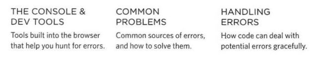
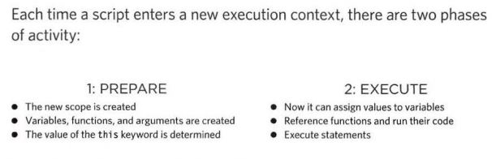
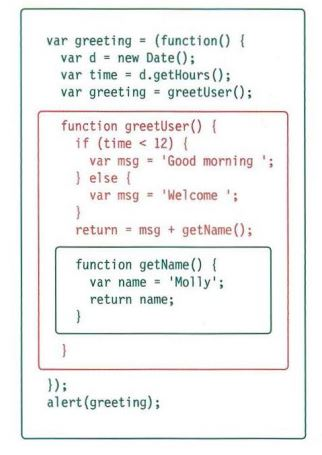
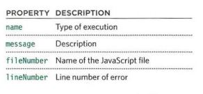
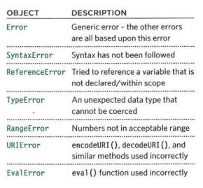

# Read10
## Error handling & debugging
there are three way to handling and fix javascript 

#### EXECUTION CONTEXT 
- GLOBAL CONTEXT : Code that is in the script, but not in a function, There is only one global context in any page. 
-FUNCTION CONTEXT : Code that is being run within a function, Each function has its own function context. 

#### VARIABLE SCOPE 
- GLOBAL SCOPE : If a variable is declared outside a function, it can be used anywhere because it has global scope. If you do not use the var keyword when creating a variable, it is placed in global scope. 
- FUNCTION-LEVEL SCOPE : When a variable is declared within a function, it can only be used within that function. This is because it has function-level scope. 

#### UNDERSTANDINGSCOPE 
- the inner functions can access the outer functions and their variables. 
- Each time a function is called, it gets its own execution context and va r i ables object. 
- Each time an outer function calls an inner function, the inner function can have a new variables object. But variables in the outer function remain the same. 

#### ERROR OBJECTS 
Error objects can help you find where your mistakes are and browsers have tools to help you read them. 

#### HOW TO DEAL WITH ERRORS 
- DEBUG THE SCRIPT TO FIX ERRORS
- HANDLE ERRORS GRACEFULLY 

#### SUMMARY
- Debugging is the process of finding errors. It involves a process of deduction. 
- The console helps narrow down the area in which the error is located, so you can try to find the exact error. 
- If you know that you may get an error, you can handle it gracefully using the try, catch, finally statements. 