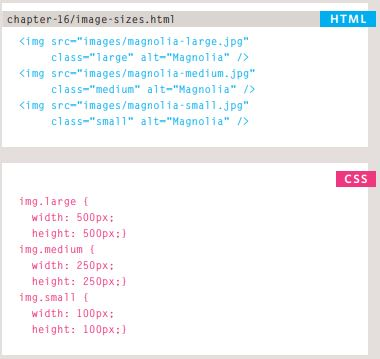
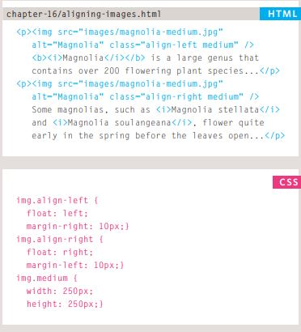
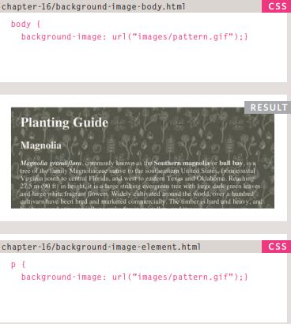
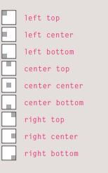

# Read11
## IMAGES
### CONTROLLING SIZE OF IMAGE IN CSS

### ALIGNING IMAGES USING CSS

### Centering images Using CSS

### ADD BACKGROUND IMAGE USING CSS

### REPEATING IMAGE 
- repeat: The background image is repeated both horizontally and vertically.
- repeat-x : The image is repeated horizontally only.
- repeat-y : The image is repeated vertically only.
- no-repeat : The image is only shown once.
- fixed : The background image stays in the same position on the page.
- scroll : The background image moves up and down as the user scrolls up and down the page.
### Background Position
This property usually has a pair of values. The first represents the horizontal position and the second represents the vertical.

## Practical Information
### SEO
Search engine optimization (or SEO) is the practice of trying to help your site appear nearer the top of search engine results when people look for the topics that your website covers.
Ensuring that any images have appropriate text in the value of their alt attribute also helps search engines understand the content of images.
Search engines also look at the words between the opening <a> tag and closing </a> tag in the link. If the text in the link contains keywords (rather than just click here or your website address) it may be considered more relevant.
### On-Page SEO
In every page of your website there are seven key places where keywords  can appear in order to improve its findability.
- Page Title 
- URL / Web Address
-  Headings
- Text
- Link Text
-  Image Alt Text
-  Page Descriptions meta tag.
### How to Identify Keywords and Phrases
- Brainstorm
- Organize
- Research
- Compare
- Refine
- Map

