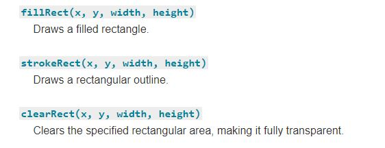

# Read12
### The canvas element
At first sight a canvas looks like the img element, with the only clear difference being that it doesn't have the src and alt attributes. Indeed, the canvas element has only two attributes, width and height. These are both optional and can also be set using DOM properties. When no width and height attributes are specified the canvas will initially be 300 pixels wide and 150 pixels high. The element can be sized arbitrarily by CSS, but during rendering the image is scaled to fit its layout size: if the CSS sizing doesn't respect the ratio of the initial canvas, it will appear distorted.
The id attribute isn't specific to the canvas element but is one of the global HTML attributes which can be applied to any HTML element (like class for instance). It is always a good idea to supply an id because this makes it much easier to identify it in a script.
he canvas element can be styled just like any normal image (margin, border, background…). These rules, however, don't affect the actual drawing on the canvas. We'll see how this is done in a dedicated chapter of this tutorial. When no styling rules are applied to the canvas it will initially be fully transparent.
### There are three functions that draw rectangles on the canvas:

