# Read14a
### Transforms
The transform property comes in two different settings, two-dimensional and three-dimensional. Each of these come with their own individual properties and values.
### Transform Syntax
The actual syntax for the transform property is quite simple, including the transform property followed by the value. The value specifies the transform type followed by a specific amount inside parentheses.

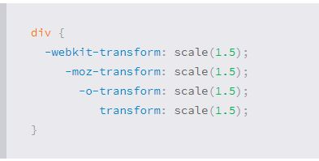

### 2D Transforms
Elements may be distorted, or transformed, on both a two-dimensional plane or a three-dimensional plane. Two-dimensional transforms work on the x and y axes, known as horizontal and vertical axes. Three-dimensional transforms work on both the x and y axes, as well as the z axis. These three-dimensional transforms help define not only the length and width of an element, but also the depth.

##### 2D Rotate
The rotate value provides the ability to rotate an element from 0 to 360 degrees. Using a positive value will rotate an element clockwise, and using a negative value will rotate the element counterclockwise. The default point of rotation is the center of the element, 50% 50%, both horizontally and vertically.

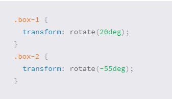

##### 2D Scale
Using the scale value within the transform property allows you to change the appeared size of an element. The default scale value is 1, therefore any value between .99 and .01 makes an element appear smaller while any value greater than or equal to 1.01 makes an element appear larger.

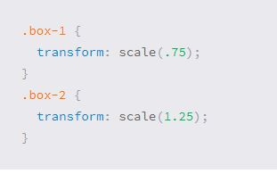

##### 2D Translate
Using the translateX value will change the position of an element on the horizontal axis while using the translateY value will change the position of an element on the vertical axis.

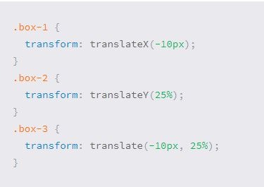

##### 2D Skew
used to distort elements on the horizontal axis, vertical axis, or both. The syntax is very similar to that of the scale and translate values. Using the skewX value distorts an element on the horizontal axis while the skewY value distorts an element on the vertical axis. To distort an element on both axes the skew value is used, declaring the x axis value first, followed by a comma, and then the y axis value.

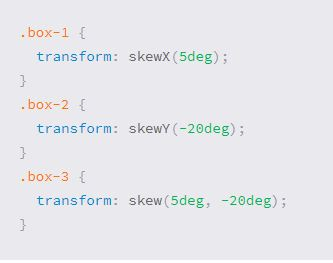

### Combining Transforms
To combine transforms, list the transform values within the transform property one after the other without the use of commas.

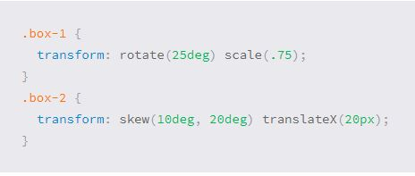

Behind every transform there is also a matrix explicitly defining the behavior of the transform. Using the rotate, scale, transition, and skew values provide an easy way to establish this matrix.

##### 2D Cube Demo
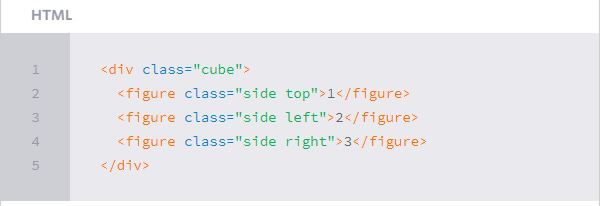
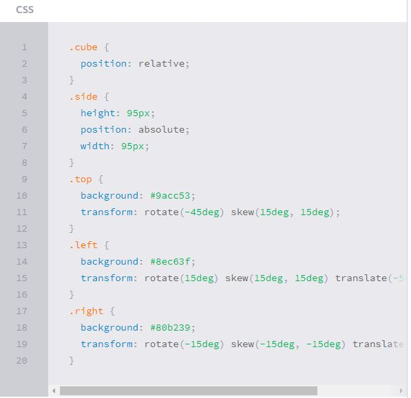

##### Transform Origin
As previously mentioned, the default transform origin is the dead center of an element, both 50% horizontally and 50% vertically. To change this default origin position the transform-origin property may be used.
The transform-origin property can accept one or two values. When only one value is specified, that value is used for both the horizontal and vertical axes. If two values are specified, the first is used for the horizontal axis and the second is used for the vertical axis.

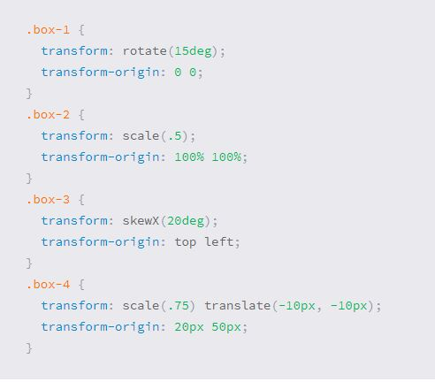

##### Perspective
The perspective of an element can be set in two different ways. One way includes using the perspective value within the transform property on individual elements, while the other includes using the perspective property on the parent element residing over child elements being transformed.
Using the perspective value within the transform property works great for transforming one element from a single, unique perspective. When you want to transform a group of elements all with the same perspective, or vanishing point, apply the perspective property to their parent element.

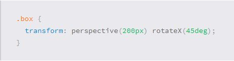

### 3D Transforms
Three-dimensional transforms we can rotate an element around any axes. To do so, we use three new transform values, including rotateX, rotateY, and rotateZ.
Using the rotateX value allows you to rotate an element around the x axis, as if it were being bent in half horizontally. Using the rotateY value allows you to rotate an element around the y axis, as if it were being bent in half vertically. Lastly, using the rotateZ value allows an element to be rotated around the z axis.

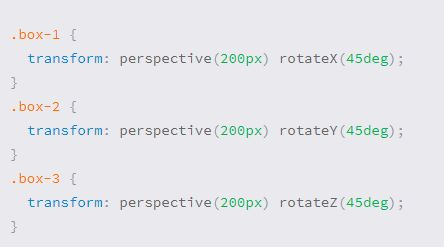

### Transitions & Animations
With CSS3 transitions you have the potential to alter the appearance and behavior of an element whenever a state change occurs, such as when it is hovered over, focused on, active, or targeted.
Animations within CSS3 allow the appearance and behavior of an element to be altered in multiple keyframes. Transitions provide a change from one state to another, while animations can set multiple points of transition upon different keyframes.

##### Transitions
Easiest way for determining styles for different states is by using the :hover, :focus, :active, and :target pseudo-classes.
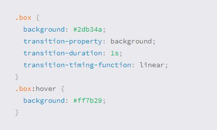

##### Transitional Property
The transition-property property determines exactly what properties will be altered in conjunction with the other transitional properties. By default, all of the properties within an element’s different states will be altered upon change. However, only the properties identified within the transition-property value will be affected by any transitions.

##### Transition Duration
The duration in which a transition takes place is set using the transition-duration property. The value of this property can be set using general timing values, including seconds (s) and milliseconds (ms). These timing values may also come in fractional measurements, .2s for example.
When transitioning multiple properties you can set multiple durations, one for each property. As with the transition-property property value, multiple durations can be declared using comma separated values. The order of these values when identifying individual properties and durations does matter.

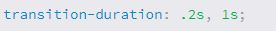

##### Transition Timing
The transition-timing-function property is used to set the speed in which a transition will move. Knowing the duration from the transition-duration property a transition can have multiple speeds within a single duration. A few of the more popular keyword values for the transition-timing-function property include linear, ease-in, ease-out, and ease-in-out.
- The linear keyword value identifies a transition moving in a constant speed from one state to another.
- The ease-in value identifies a transition that starts slowly and speeds up throughout the transition.
- ease-out value identifies a transition that starts quickly and slows down throughout the transition.
- The ease-in-out value identifies a transition that starts slowly, speeds up in the middle, then slows down again before ending.

##### Transition Delay
On top of declaring the transition property, duration, and timing function, you can also set a delay with the transition-delay property. The delay sets a time value, seconds or milliseconds, that determines how long a transition should be stalled before executing. As with all other transition properties, to delay numerous transitions, each delay can be declared as comma separated values.
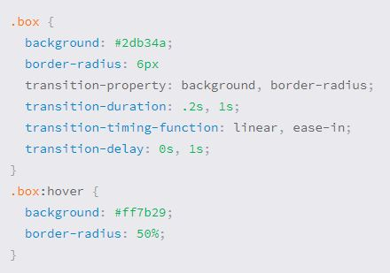

##### Shorthand Transitions
Declaring every transition property individually can become quite intensive, especially with vendor prefixes. Fortunately there is a shorthand property, transition, capable of supporting all of these different properties and values. Using the transition value alone, you can set every transition value in the order of transition-property, __transition-duration, transition-timing-function, and lastly transition-delay__.
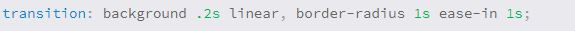
