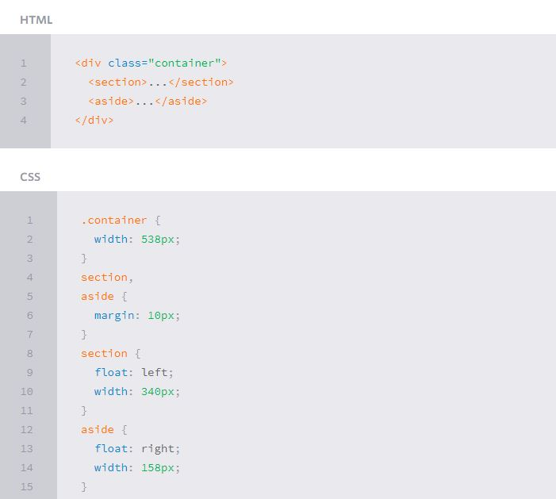
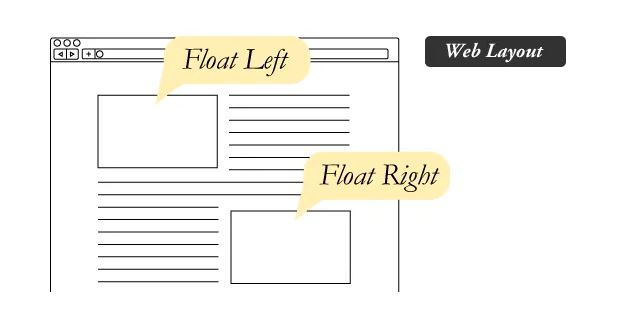

# Responsive Web Design

With the growth in mobile Internet usage comes the question of how to build websites suitable for all users. The industry response to this question has become responsive web design, also known as RWD.

Responsive web design is broken down into three main components, including flexible layouts, media queries, and flexible media

###  flexible layouts
is the practice of building the layout of a website with a flexible grid, capable of dynamically resizing to any width. Flexible grids are built using relative length units, most commonly percentages or em units.
Flexible layouts do not advocate the use of fixed measurement units, such as pixels or inches. 
Reason being, the viewport height and width continually change from device to device. Website layouts need to adapt to this change and fixed values have too many constraints.

##### Flexible Grid

### Media Queries
Media queries were built as an extension to media types commonly found when targeting and including styles. Media queries provide the ability to specify different styles for individual browser and device circumstances, the width of the viewport or device orientation.
There are a couple different ways to use media queries, using the @media rule inside of an existing style sheet, importing a new style sheet using the @import rule, or by linking to a separate style sheet from within the HTML document.
Recommend to use the @media rule inside of an existing style sheet to avoid any additional HTTP requests.

##### Logical Operators in Media Queries
There are three different logical operators available for use within media queries, including and, not, and only.
@media all and (min-width: 800px) and (max-width: 1024px) {...}
@media not screen and (color) {...}
@media only screen and (orientation: portrait) {...}

### What is “Float”?
Float is a CSS positioning property

In web design, page elements with the CSS float property applied to them are just like the images in the print layout where the text flows around them. Floated elements remain a part of the flow of the web page. This is distinctly different than page elements that use absolute positioning. Absolutely positioned page elements are removed from the flow of the webpage, like when the text box in the print layout was told to ignore the page wrap. Absolutely positioned page elements will not affect the position of other elements and other elements will not affect them, whether they touch each other or not.

### Clearing the Float
Float’s sister property is clear. An element that has the clear property set on it will not move up adjacent to the float like the float desires, but will move itself down past the float. Again an illustration probably does more good than words do.

##### Problems with Floats
1. Pushdown
1. Double Margin Bug 
1. Bottom Margin Bug
 