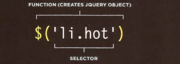
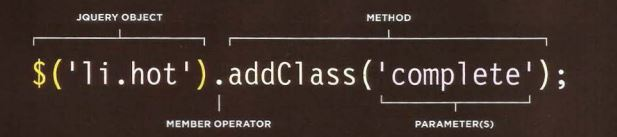
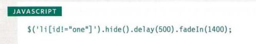
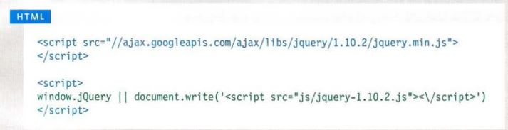

# JQuery
jQuery offers a simple way to achieve a variety of common JavaScript tasks quickly and consistently, across all major browsers and without any fallback code needed. 

- Find element using css-style selector

- Do somthing with element using jQuery

#### WHY USE JQUERY?
- SIMPLE SELECTORS 
- COMMON TASKS IN LESS CODE 
- CROSS-BROWSER COMPATIBILITY 

Query's motto is "Write less, do more," because it allows you to achieve
the same goals but in fewer lines of code than you would need to write
with plain JavaScript. 

#### a matched set jQuery selection

If you want to use more than one jQuery method on the same selection of elements, you can list several methods at a time using dot notation to separat.

#### GETTING ELEMENT CONTENT 
The • htm 1 () and • text () methods both retrieve and update the content of elements. This page will focus on how to retrieve element content. 
- . html()  
is used to retrieve information from a jQuery selection, it retrieves only the HTML inside the first element in the matched set, along with any of its descendants. 
- . text()
it returns the content from every element in the jQuery selection, along with the text from any descendants. 

- .replaceWith()  
This method replaces every element in a matched set with new content. It also returns the replaced elements. 

- . remove() 
This method removes all of the elements in the matched set. 

#### INSERTING ELEMENTS 
Inserting new elements involves two steps:
1. Create the new elements in a jQuery object 
1. Use a method to insert the content into the page 

- .before() 
This method inserts content before the selected element(s).
- .after() 
This method inserts content after the selected element(s).  
- .prepend() 
This method inserts content inside the selected element(s), after the opening tag. 
- .append() 
This method inserts content inside the selected element(s), before the closing tag. 

## Ways to include jQuery in your page
In addition to hosting the jQuery file with the rest of your website, you can also use a version that is hosted by other companies.
using CDN

#### LOADING JQUERY FROM A CDN 

The position of script elements can affect how quickly a web page seems to load. 
don't place the script tags in the head of the page  you do with style sheets, we must add it in the page before the closing body tag.

#### Why pair program?
1. Greater efficiency
1. Engaged collaboration
1. Learning from fellow students
1. Social skills
1. Job interview readiness
1. Work environment readiness