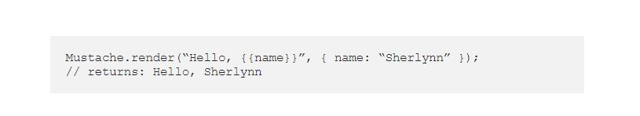
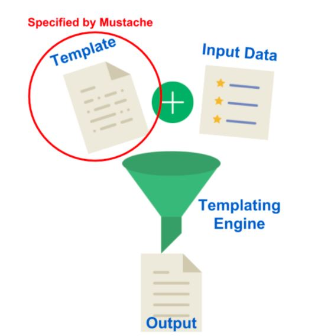
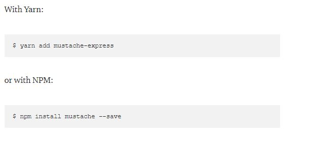
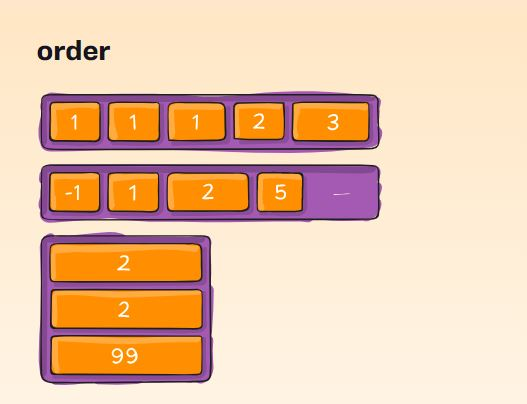
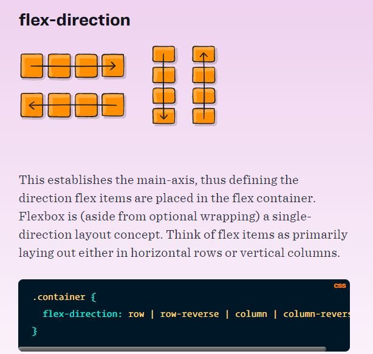
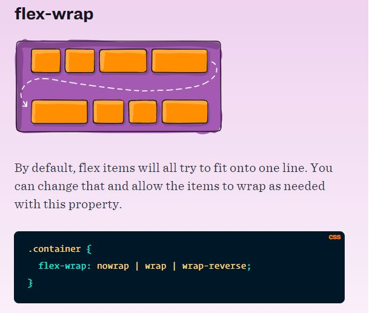

# Read03

## Javascript Templating
Javascript templating is a fast and efficient technique to render client-side view templates with Javascript by using a JSON data source.

Mustache is a logic-less template syntax. It can be used for HTML, config files, source code — anything. It works by expanding tags in a template using values provided in a hash or object.

It is often referred to as “logic-less” because there are no if statements, else clauses, or for loops. Instead, there are only tags. Some tags are replaced with a value, some nothing, and others a series of values.

Mustache is NOT a templating engine. Mustache is a specification for a templating language. In general, we would write templates according to the Mustache specification, and it can then be compiled by a templating engine to be rendered to create an output.

## Flexbox

#### Properties for the Parent :
This defines a flex container; inline or block depending on the given value. It enables a flex context for all its direct children.

#### Properties for the Children :
By default, flex items are laid out in the source order. However, the order property controls the order in which they appear in the flex container.

#### flex-direction

#### flex-grow
This defines the ability for a flex item to grow if necessary. It accepts a unitless value that serves as a proportion. It dictates what amount of the available space inside the flex container the item should take up.

#### flex-wrap

- nowrap
- wrap
- wrap-reverse

#### flex-shrink
This defines the ability for a flex item to shrink if necessary.

