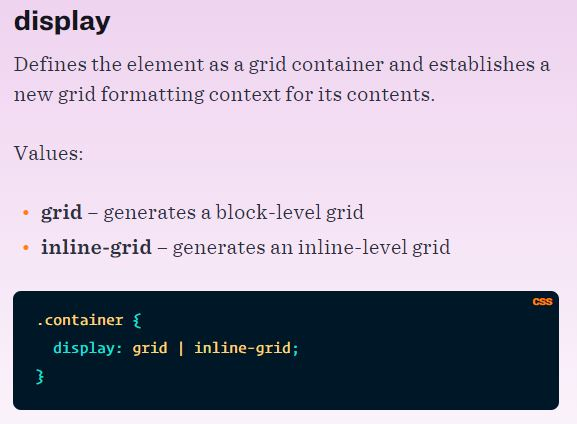
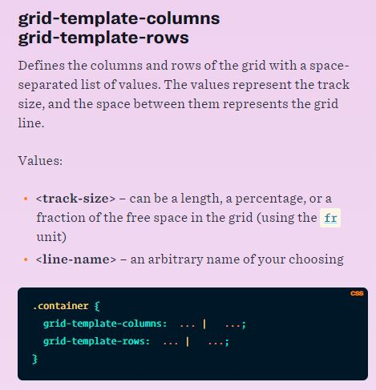
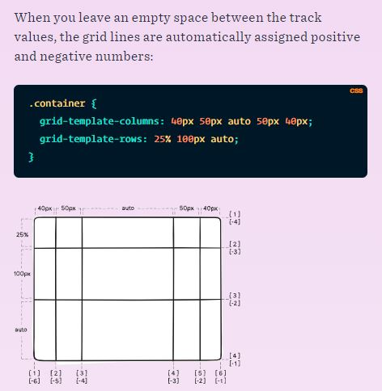
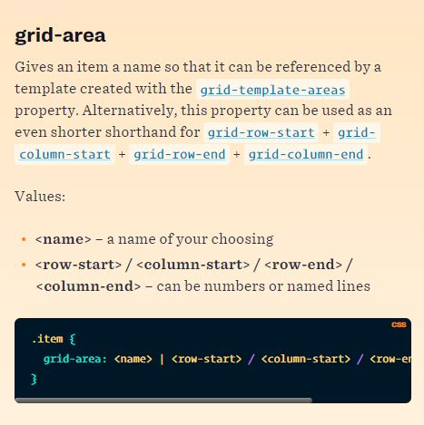

# Grid
CSS Grid Layout is the most powerful layout system available in CSS.

#### justify-content
- start – aligns the grid to be flush with the start edge of the grid container
- end – aligns the grid to be flush with the end edge of the grid container
- center – aligns the grid in the center of the grid container
- stretch – resizes the grid items to allow the grid to fill the full width of the grid container
- space-around – places an even amount of space between each grid item, - with half-sized spaces on the far ends
- space-between – places an even amount of space between each grid item, with no space at the far ends
- space-evenly – places an even amount of space between each grid item, including the far ends

