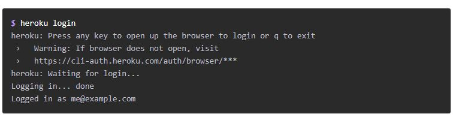

## Getting Started on Heroku with Node.js
 In this step you’ll install the Heroku Command Line Interface (CLI). You use the CLI to manage and scale your applications, provision add-ons, view your application logs, and run your application locally.

- $sudo snap install heroku --classic

When installation completes, you can use the heroku command from your terminal.

On Windows, start the Command Prompt (cmd.exe) or Powershell to access the command shell.
Use the heroku login command to log in to the Heroku CLI:

- git clone https://github.com/heroku/node-js-getting-started.git
- cd node-js-getting-started

- $heroku ps:scale web=1

- $heroku open

