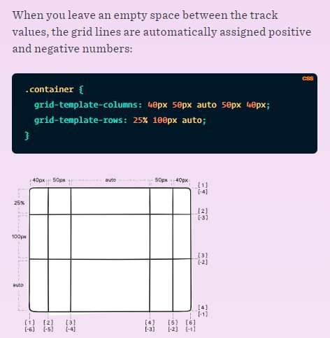

# Node.js

### What Is Node.js?
Node.js is an event-based, non-blocking, asynchronous I/O runtime that uses Google’s V8 JavaScript engine and libuv library.

Node Is Built on Google Chrome’s V8 JavaScript Engine

The V8 engine is the open-source JavaScript engine that runs in Google Chrome and other Chromium-based web browsers, including Brave, Opera, and Vivaldi. It was designed with performance in mind and is responsible for compiling JavaScript directly to native machine code that your computer can execute.

when we say that Node is built on the V8 engine, we don’t mean that Node programs are executed in a browser. 
They took the V8 engine and enhanced it with various features, such as a file system API, an HTTP library, and a number of operating system–related utility methods.

Node.js Has Excellent Support for Modern JavaScript
As can be seen on this compatibility table, Node has excellent support for ECMAScript 2015 (ES6) and beyond. As you’re only targeting one runtime (a specific version of the V8 engine), this means that you can write your JavaScript using the latest and most modern syntax. It also means that you don’t generally have to worry about compatibility issues — as you would if you were writing JavaScript that would run in different browsers.

### Introducing npm, the JavaScript Package Manager
Node comes bundled with a package manager called npm
In addition to being the package manager for JavaScript, npm is also the world’s largest software registry. There are over 1,000,000 packages of JavaScript code available to download, with billions of downloads per week. Let’s take a quick look at how we would use npm to install a package.

### What Is Node.js Used For?
These build tools come in all shapes and sizes, and you won’t get far in a modern JavaScript landscape without bumping into them. They can be used for anything from bundling your JavaScript files and dependencies into static assets

And if you want to start developing apps with any modern JavaScript framework (for example, React or Angular), you’ll be expected to have a working knowledge of Node and npm (or maybe Yarn). This isn’t because you need a Node back end to run these frameworks. You don’t. Rather, it’s because these frameworks (and many, many related packages) are all available via npm and rely on Node to create a sensible development environment in which they can run.

