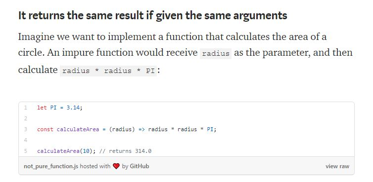
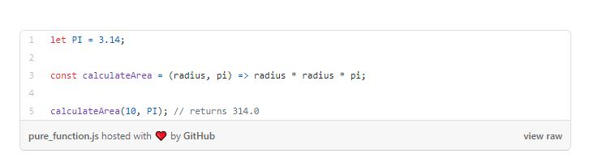
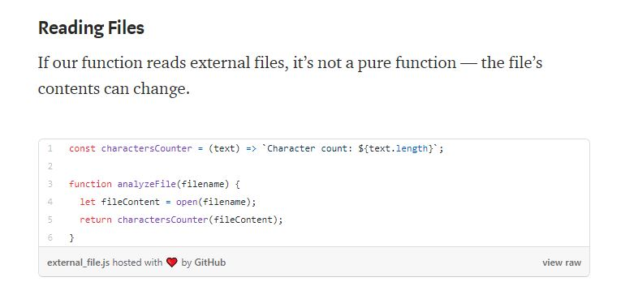

# Read 09

## What is functional programming?
Functional programming is a programming paradigm — a style of building the structure and elements of computer programs — that treats computation as the evaluation of mathematical functions and avoids changing-state and mutable data

## Pure functions benefits
The code’s definitely easier to test. We don’t need to mock anything. So we can unit test pure functions with different contexts:
- Given a parameter A → expect the function to return value B
- Given a parameter C → expect the function to return value D
A simple example would be a function to receive a collection of numbers and expect it to increment each element of this collection.

Functions as first-class entities can:
- refer to it from constants and variables
- pass it as a parameter to other functions
- return it as result from other functions
