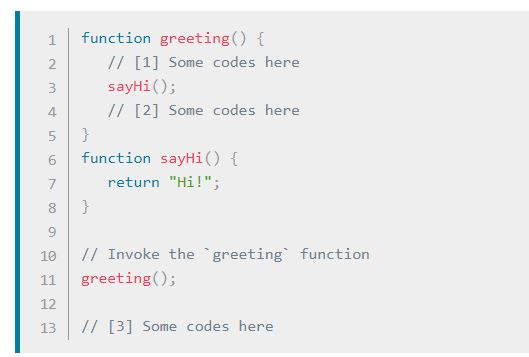

# Read10
## Call stack
A call stack is a mechanism for an interpreter (like the JavaScript interpreter in a web browser) to keep track of its place in a script that calls multiple functions — what function is currently being run and what functions are called from within that function, etc.

- When a script calls a function, the interpreter adds it to the call stack and then starts carrying out the function.
- Any functions that are called by that function are added to the call stack further up, and run where their calls are reached.
- When the current function is finished, the interpreter takes it off the stack and resumes execution where it left off in the last code listing.
- If the stack takes up more space than it had assigned to it, it results in a "stack overflow" error.

#### Example 

1. Ignore all functions, until it reaches the greeting() function invocation.
1. Add the greeting() function to the call stack list.
1. Execute all lines of code inside the greeting() function.
1. Get to the sayHi() function invocation.
1. Add the sayHi() function to the call stack list.
1. Execute all lines of code inside the sayHi() function, until reaches its end.
1. Return execution to the line that invoked sayHi() and continue executing the rest of the greeting() function.
1. Delete the sayHi() function from our call stack list.
1. When everything inside the greeting() function has been executed, return to its invoking line to continue 1- executing the rest of the JS code.
1- Delete the greeting() function from the call stack list

## The JavaScript Call Stack - What It Is and Why It's Necessary
The call stack is primarily used for function invocation (call). Since the call stack is single, function(s) execution, is done, one at a time, from top to bottom. It means the call stack is synchronous.
The understanding of the call stack is vital to Asynchronous programming
In Asynchronous JavaScript, we have a callback function, an event loop, and a task queue. The callback function is acted upon by the call stack during execution after the call back function has been pushed to the stack by the event loop.

## Types of error messages
- Reference errors
- Syntax errors
- Range errors
- Type errors
- 
