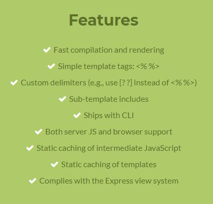
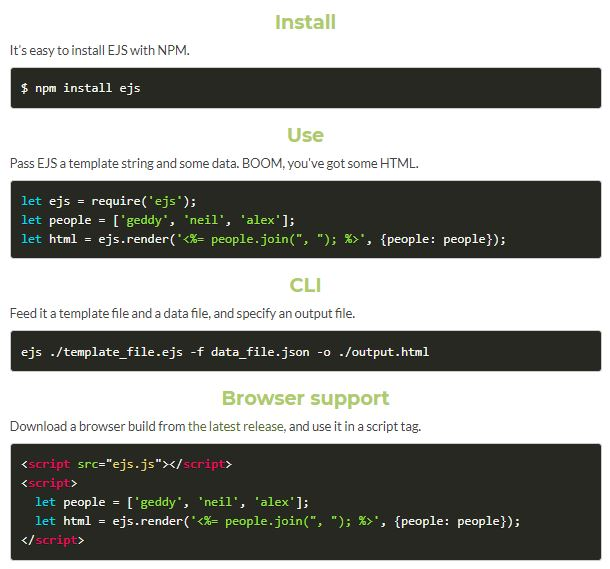
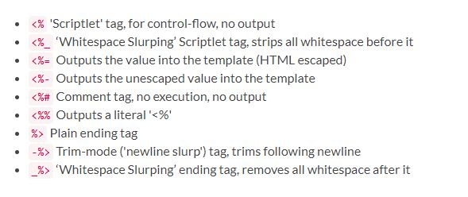
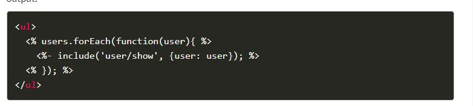

# EJS
### What is EJS?
What is the "E" for? "Embedded?" Could be. How about "Effective," "Elegant," or just "Easy"? EJS is a simple templating language that lets you generate HTML markup with plain JavaScript. No religiousness about how to organize things. No reinvention of iteration and control-flow. It's just plain JavaScript.

### to get start

### Tags

### Includes
Includes are relative to the template with the include call. (This requires the 'filename' option.) For example if you have "./views/users.ejs" and "./views/user/show.ejs" you would use <%- include('user/show'); %>.

