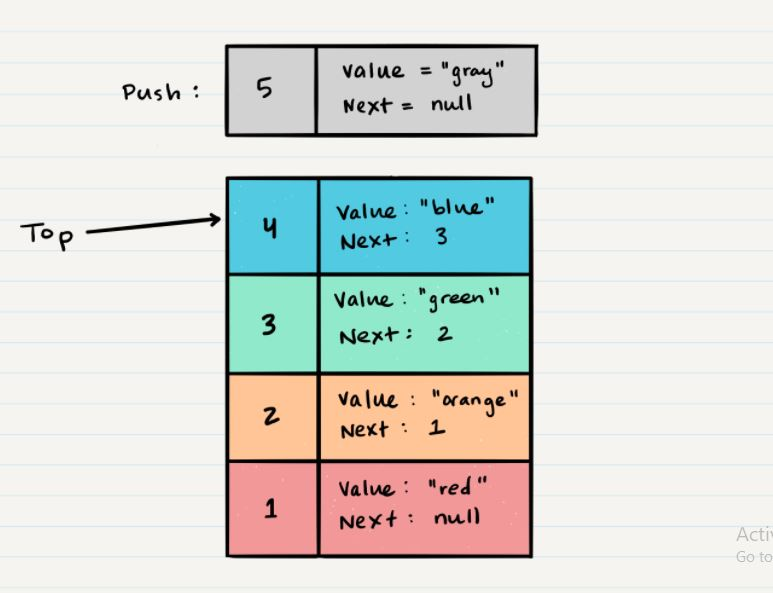

# Stacks and Queues

#### What is a Stack
A stack is a data structure that consists of Nodes. Each Node references the next Node in the stack, but does not reference its previous.

#### terminology for a stack
- Push - Nodes or items that are put into the stack are pushed
- Pop - Nodes or items that are removed from the stack are popped. When you attempt to pop an empty stack an exception will be raised.
- Top - This is the top of the stack.
- Peek - When you peek you will view the value of the top Node in the stack. When you attempt to peek an empty stack an exception will be raised.
- IsEmpty - returns true when stack is empty otherwise returns false.

#### Stacks follow these concepts:
- **FILO**
First In Last Out

This means that the first item added in the stack will be the last item popped out of the stack.

- **LIFO**
Last In First Out

This means that the last item added to the stack will be the first item popped out of the stack.

- **Push O(1)**
Pushing a Node onto a stack will always be an O(1) operation. This is because it takes the same amount of time no matter how many Nodes (n) you have in the stack.

#### steps
1. First, you should have the Node that you want to add. Here is an example of a Node that we want to add to the stack. 

1. Next, you need to assign the next property of Node 5 to reference the same Node that top is referencing: Node 4

1. Technically at this point, your new Node is added to your stack, but there is no indication that it is the first Node in the stack. To make this happen, you have to re-assign our reference top to the newly added Node, Node 5.

